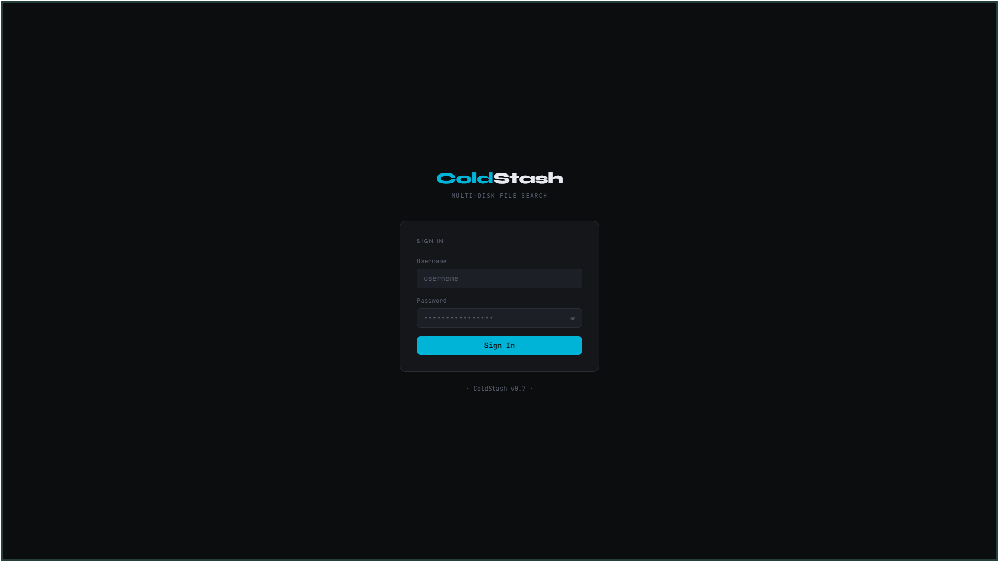
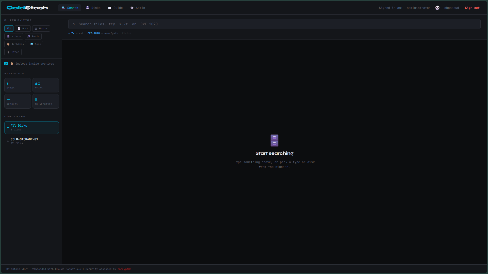
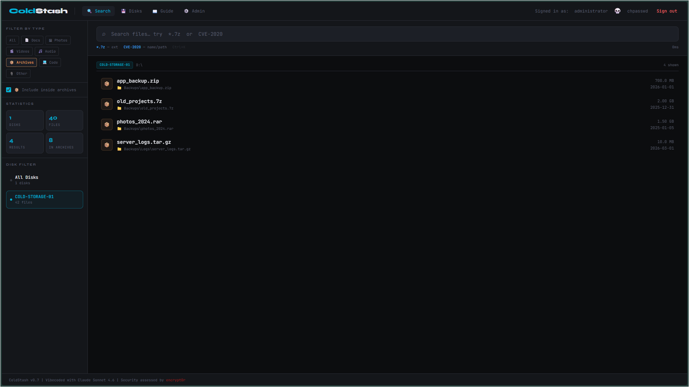
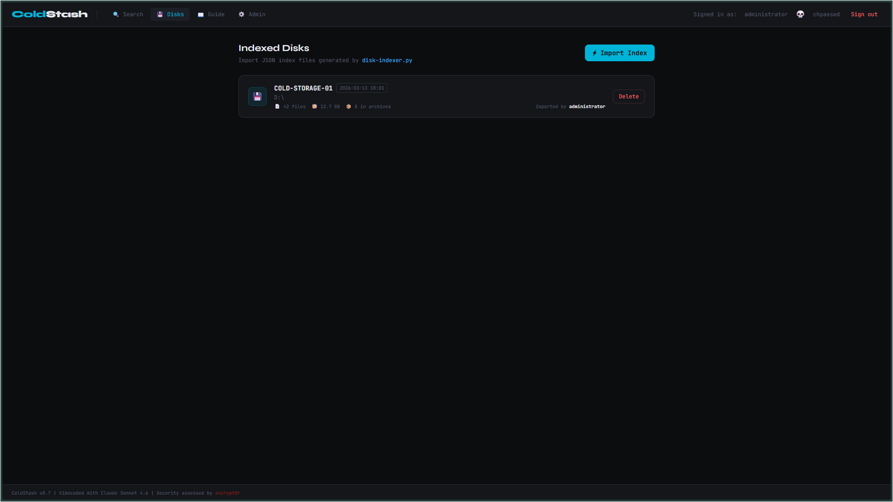
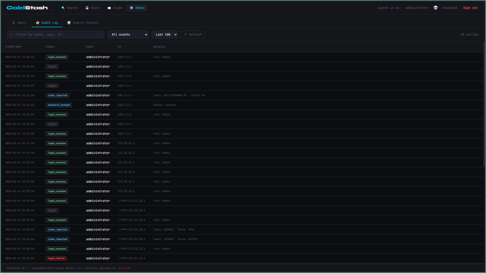
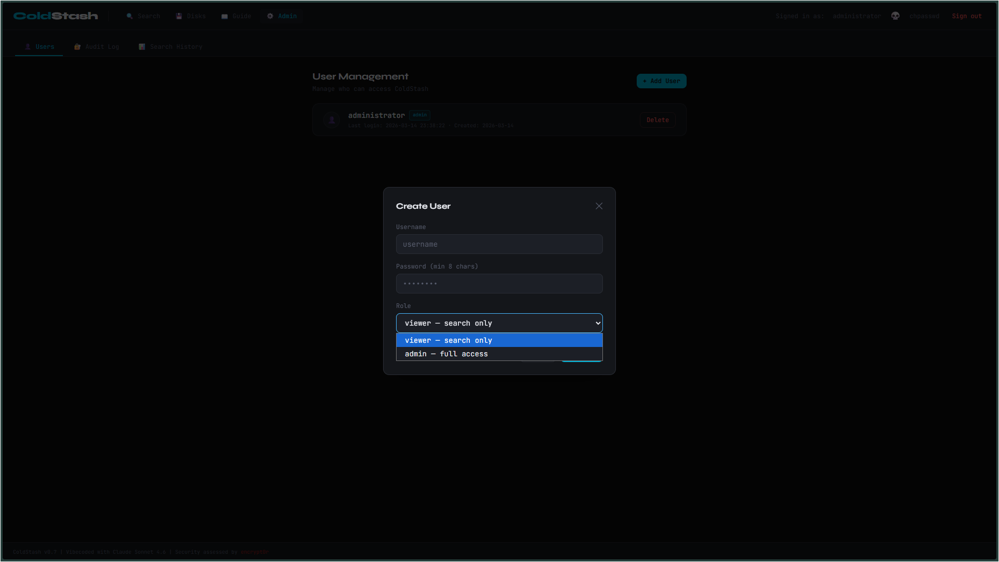

# ColdStash

> A Cold Storage Multi-Disk File Indexer designed for environments where data is distributed across many removable or offline disks. The software catalogs file metadata from each disk and stores it in a central index, enabling fast search and identification of files across an entire archive without needing to mount or spin up every storage device.
>
> ⚠️ This project was fully Vibe Coded by AI and reviewed by a human. Bugs, security issues, or unexpected behavior may still exist. Use at your own risk and validate it before relying on it.
---



## Overview

ColdStash indexes your external hard drives once while they're connected, stores the file tree in a local database, then lets you search across all disks instantly — even when the drives are sitting on a shelf. Built for people who archive large collections across many HDDs.

## Features

- **Full-text search** across all indexed disks simultaneously, with real-time results
- **Type filters** — Docs, Photos, Videos, Audio, Archives, Code, Other
- **Archive-aware** — searches inside `.zip`, `.7z`, `.rar`, `.tar.gz` contents
- **Disk filter** — narrow results to a specific drive
- **Role-based access** — `viewer` (search only) vs `admin` (full access)
- **Audit log** — every login, import, delete, and password change is recorded
- **Search history** — every query logged with user, timestamp, and result count
- **OWASP-hardened** — bcrypt passwords, JWT sessions, rate limiting, CSP headers

## Screenshots

| Search | Type Filter |
|--------|-------------|
|  |  |

| Indexed Disks | Audit Log |
|---------------|-----------|
|  |  |

## Quick Start

### Docker (recommended)
```bash
# 1. Generate a JWT secret and set it in .env
echo "JWT_SECRET=$(openssl rand -hex 32)" >> .env

# 2. Build and start
docker compose -f docker-compose.yml up -d --build

# 3. Get the generated admin password
docker compose cp coldstash:/app/data/.admin_password ./
cat .admin_password
# Username: administrator

# 4. Delete the password file after noting it
rm .admin_password
docker compose exec coldstash rm /app/data/.admin_password
```

### Local (without Docker)
```bash
# 1. Install dependencies
npm install

# 2. Set your JWT secret (min 32 chars)
cp .env.example .env.local
# Edit .env.local and set JWT_SECRET

# 3. Run dev server
npm run dev
# → http://localhost:3000

# 4. Get the generated admin password
cat data/.admin_password
```

Set a known admin password instead of a random one by adding to `.env` / `.env.local`:
```bash
ADMIN_PASSWORD=your-chosen-password
```

## Indexing Your Disks

ColdStash ships with `disk-indexer.py` — a Python script you run on Windows while the drive is connected. The Guide page inside the app has full step-by-step instructions.
```bash
# One-time setup
pip install py7zr rarfile

# Index each drive (assign a label matching your physical label)
python disk-indexer.py COLD-STORAGE-01 E:\
python disk-indexer.py COLD-STORAGE-02 F:\

# Skip archive scanning for large drives
python disk-indexer.py COLD-STORAGE-03 G:\ --no-archives
```

Then import the generated `.json` file via **Disks → ⚡ Import Index** in the web UI. The drive does not need to be connected for import or search.

## Roles

| Role | Permissions |
|------|-------------|
| `viewer` | Search files, view disk list, read guide |
| `admin` | All viewer permissions + import/delete disks, manage users, read audit log and search history |

Roles are assigned per user via **Admin → Users → Add User**.



## Production Deployment

See [Docker deployment guide](#docker-recommended) above. For HTTPS with Nginx:
```nginx
location / {
    proxy_pass         http://127.0.0.1:3000;
    proxy_set_header   X-Forwarded-Proto $scheme;
    proxy_read_timeout 300s;
    client_max_body_size 500m;
}
```

The `X-Forwarded-Proto` header is required — ColdStash uses it to decide whether to set the `Secure` flag on the session cookie.

## Security

| OWASP | Control |
|-------|---------|
| A01 Broken Access Control | Edge middleware enforces auth on every route before the page renders |
| A02 Cryptographic Failures | `jose` HS256 JWT · bcrypt cost=12 · httpOnly + SameSite=Strict cookie |
| A03 Injection | Zod validates all API inputs · parameterised SQLite queries throughout |
| A04 Insecure Design | Least-privilege RBAC · viewers cannot reach any admin endpoint |
| A05 Security Misconfiguration | CSP, X-Frame-Options, Referrer-Policy set globally in `next.config.js` |
| A07 Auth Failures | Constant-time bcrypt (dummy hash for missing users) · rate limit 10/60s per IP |
| A09 Logging & Monitoring | Append-only JSON audit log for every auth and admin action |

## Tech Stack

- **Next.js 16** — App Router, API routes, Edge middleware
- **TypeScript** — end to end
- **Tailwind CSS** — dark theme, JetBrains Mono + Syne fonts
- **better-sqlite3** — embedded SQLite, WAL mode
- **jose** — JWT (no PyJWT timezone bugs)
- **bcryptjs** — password hashing
- **Zod** — runtime input validation
- **Docker** — multi-stage build, rootless-compatible